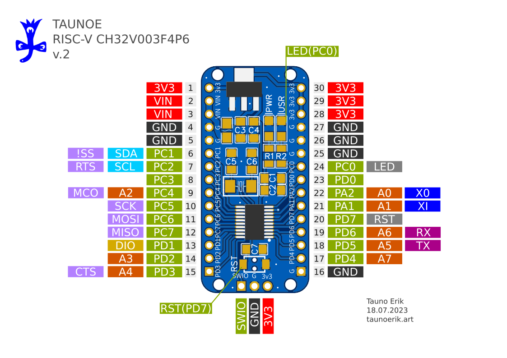
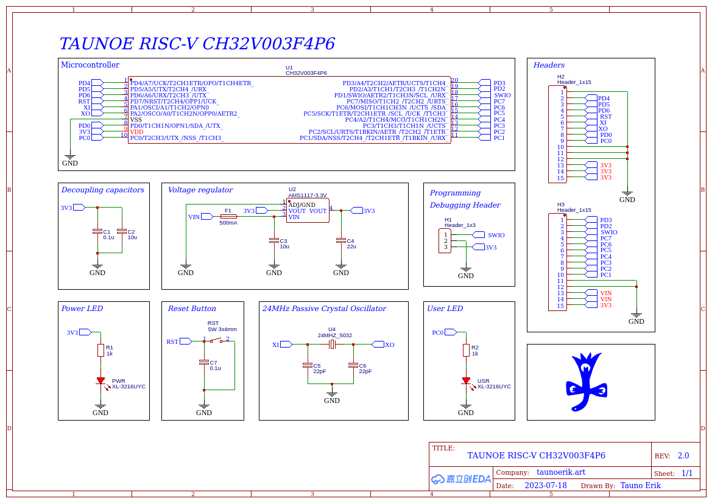

# Taunoe RISC-V CH32V003F4P6

RISC-V CH32V003F4P6 development board

Board size 44x21 mm.

## Pins

[Pins Default Functions tabel](pin_tabel.md)

- PD1 **SWIO** is required for programming and debugging. Do not reuse PD1 for other functions.

## Schematic

[Schematic.pdf](Schematic_CH332V003F4P6.pdf)

### WCH example code

[Example code](example_code/README.md)

## Links

- [32-bit general-purpose RISC-V MCU-CH32V003](https://www.wch-ic.com/products/CH32V003.html)
- [github.com/cnlohr/ch32v003fun](https://github.com/cnlohr/ch32v003fun) development environment (tooling, headers, examples)
- [github.com/Community-PIO-CH32V/platform-ch32v](https://github.com/Community-PIO-CH32V/platform-ch32v) development platform for PlatformIO

_______________
Tauno Erik ♥ Väimela ♥ 2025
